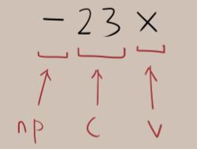

#EasyEquations

####ssterm(sst) (Super Simple term):
>ssterm puede tener una sola variable. Y esta no puede tener exponenciales de ningun tipo.
>sst esta compuesto de:
>- "np" (negative prefix), esta puede ser null.
>- "c" (coefficient)
>- "v" (variable)
 
>Entonces:
>sst formato --> np c v
>Ejemplos de sst validos: 
>    -27x (np c v)
>    27x  (   c v)
>    -74  (np c  )
>    x    (     v)
>    -x   (np   v)
> 
>Ejemplos de sst invalidos:
>    -27x^2
>    27x^1
>    x27
>    17-x
>
>
>